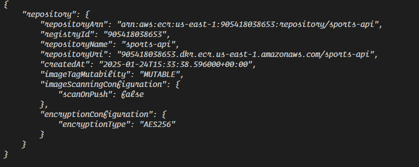
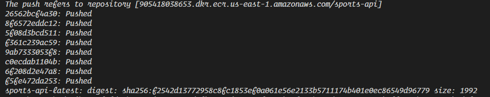
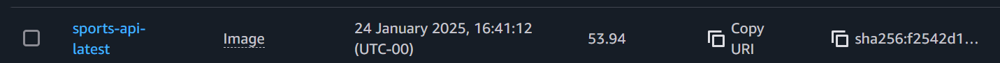
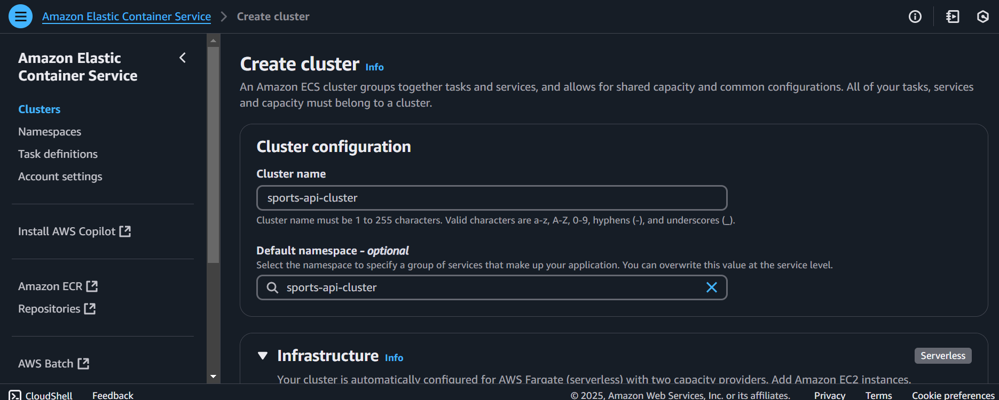
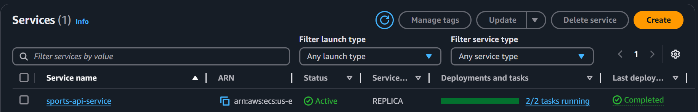
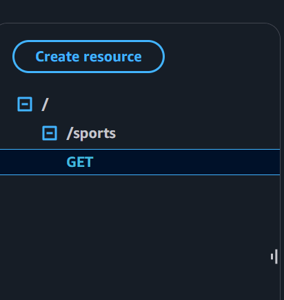

# GAME SCHEDULE

A **container** allows us to run and package apps and the required dependencies that the application needs
Having multiple containers provides high availability, the application load balancer directs traffic between the containers
A **dockerfile** creates an image from the container
**ECS** runs the dockerized flask app in a scalable serverless environment using AWS Fargate - serverless compute for ECS
The **API Gateway** creates the sports api endpoint which users will use to access the data

## STEP 1: Create ECR Repository
ECR is a private docker registry on AWS that stores images so they can be run by ECS and Fargate

Run `aws ecr create-repository --repository-name sports-api --region us-east-1` to create a repository called sports-api in the us-east-1 region

If you go into ECR on the AWS console you should see that your container has successfully been created

### Log into the ECR
Run `aws ecr get-login-password --region us-east-1 | docker login --username AWS --password-stdin <AWS_ACCOUNT_ID>.dkr.ecr.us-east-1.amazonaws.com`

This command retrieves a temporary authentication token from AWS ECR (Elastic Container Registry) and uses it to log in to the specified ECR registry for Docker operations.

If the log in was successful, you should see: 

## STEP 2: Build the Image
An image is built based on the Dockerfile

Create a file called Dockerfile, the Dockerfile:
- specify the base image, this is like a starting template for the image we are creating
- copy the requirements.txt file into the container, this file contains all the dependencies the application needs
- install all the dependencies in the requirements file
- copy all the files in this directory into the container, basically moving the entire application into the container
- expose the port the application runs on so we can access it
- run the application using the python commands

## STEP 3: Build the application
platform specifies the architecture that is compatible with fargate
`docker build --platform linux/amd64 -t sports-api .`
tag the local build image with the uri of ecr, the uri tells docker where to push the image 
`docker tag sports-api:latest <AWS_ACCOUNT_ID>.dkr.ecr.us-east-1.amazonaws.com/sports-api:sports-api-latest`
push the image to ecr
`docker push <AWS_ACCOUNT_ID>.dkr.ecr.us-east-1.amazonaws.com/sports-api:sports-api-latest`

## Step 4: Create ECS Cluster
A cluster is the infratsructure on which the containers are hosted
Go into the console, search for ECS and create a cluster

### Create a Task definition
Go to the task tab and create a task definition
A task definition is a single unit/container that performs a specific job, the smallest deployable unit in ECS that represents a single copy of a running container

Give the task a name, then go down and give the details for your container. Copy the URI of the image created in ECR and paste it in the "image uri" input box for yoru container
Set the container port as the port defined in the Dockerfile(8080)
Add the SPORTS_API_KEY as an environment variable
Then click create

### Create cluster service
Go back to the cluster tab and create a service
Service ensures that a specific number of tasks are running and handles scaling

In the deployment configuration tab, select your task (sports-api-task) as the task definition family, give your service a name (sports-api-service)

Select 2 as the number of tasks to run, meaning 2 containers will be running
In the Netwrking section, under 'security group', create a new security , and set the type to 'All TCP'
and the source as 'Anywhere'

## Step 5: Create Load Balancer
Go into the 'Load Balancing' section and select 'Use load balancing'
The load balancer type will be Application Load Blanacer
give the load balancer a name(sports-api-alb)
set the health check path to /sports
Click create

To view the load balancer, go to EC2 > Load balancing > load balancers, the load balancer should appear there once created

Running Services

## Step 6: Access New API
The newly created API will be the DNS name attached to the loadbalancer
add the suffix, /sports to the DNS url since that was the path set when creating the loadbalancer: 

Using this url, we can access the data

## Step 7: Accessing the api using a gateway
Build a REST API
Give the API a name(Sports_API) and click create
Go to the resource tab and create a resource called /sports
Create a method under the resource - a GET Http request
The endpoint url will be the url we used to access the data previously

Next click on deploy API

